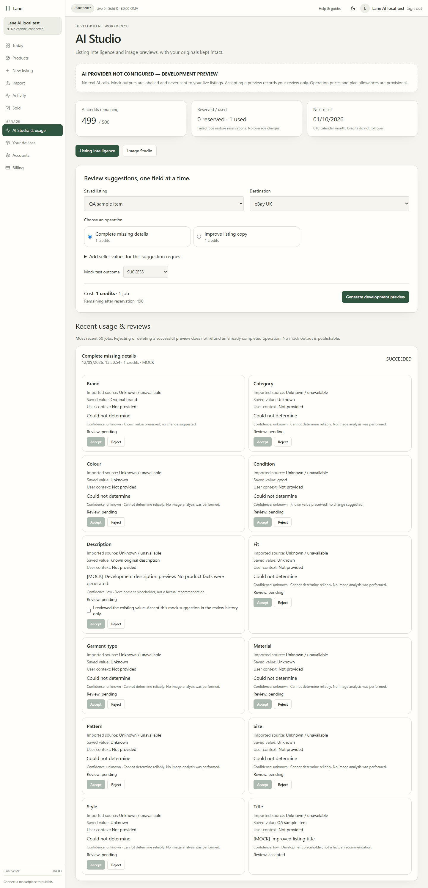
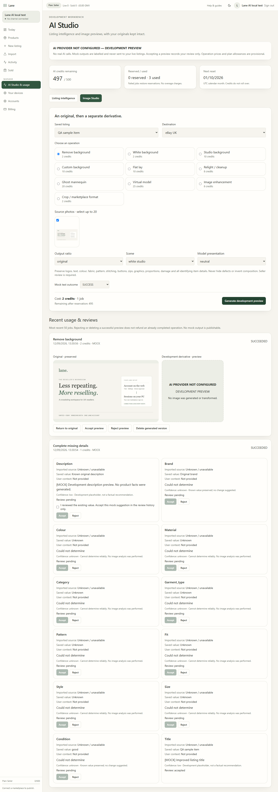
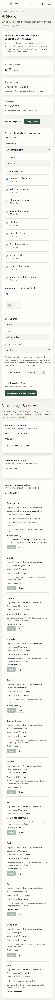

# AI skeleton review — 12 September 2026

**LOCAL PRODUCTION BUILD — MOCK ENABLED ONLY FOR ISOLATED TESTS.**

The normal local process and Render configuration have AI flags OFF. This is a synthetic Seller test account; the source photo is Lane's own test graphic. No real marketplace data or AI-generated imagery is shown. Accepted mock suggestions only record reviews, and never alter sellable listings.

17 PostgreSQL AI tests and 11 focused regressions passed. Browser proof exercised a zero-credit trial, mock listing acceptance, image preview/deletion, unchanged originals and failed-job refund. No automated axe violations on the checked workbench; no horizontal overflow at 320, 390 and 768 pixels. No external browser requests. Typecheck and production build passed; actual disabled-state browser check also passed after restoring the normal process.

See [architecture and release limits](../AI_ARCHITECTURE.md). These are mock architecture proofs, not evidence of real model quality, cost or fidelity.

## Listing intelligence

## Image Studio

## Narrow mobile, including a refunded test

