# Lane website review gallery

**LOCAL PRODUCTION BUILD — 12 September 2026. Not live staging.**

Captured from the actual Node production server on localhost, using a synthetic Lane acceptance account and an isolated persistent PostgreSQL test database. These images do not show real customer listings or marketplace credentials. The device card is from a protocol test, not proof of a packaged desktop connected to staging. Support intake is disabled in the deployment defaults.

[QA results and limitations](../WEBSITE_QA.md) · [Deployment handoff](../DEPLOYMENT_HANDOFF.md)

## Homepage — desktop

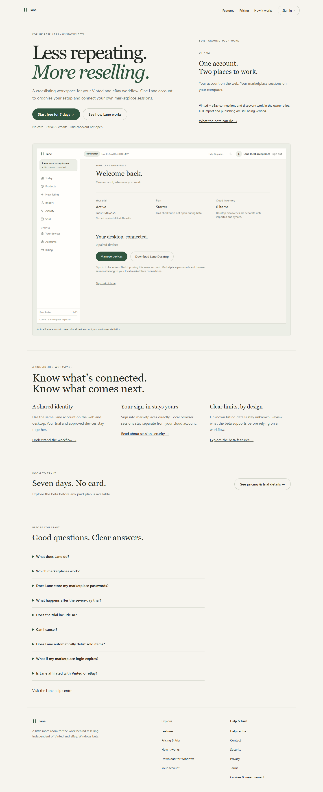

## Homepage — mobile

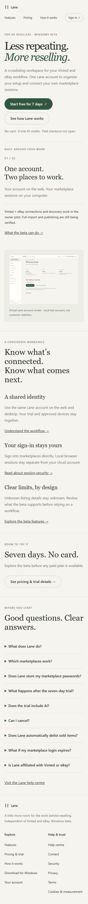

## Homepage — narrow mobile

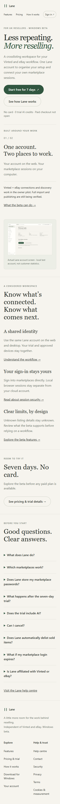

## Features

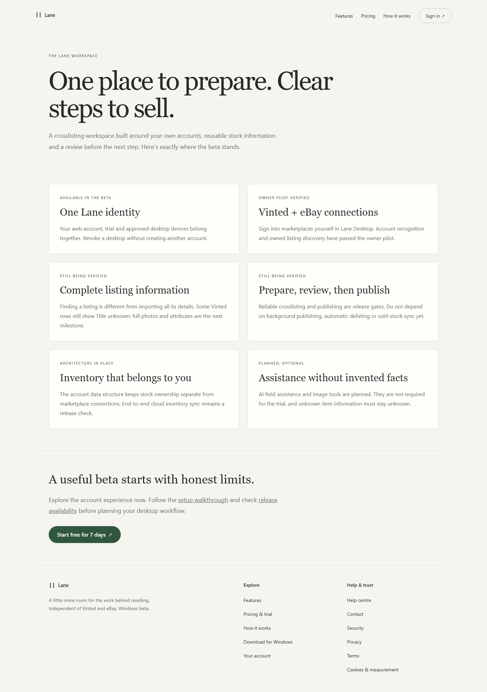

## Pricing

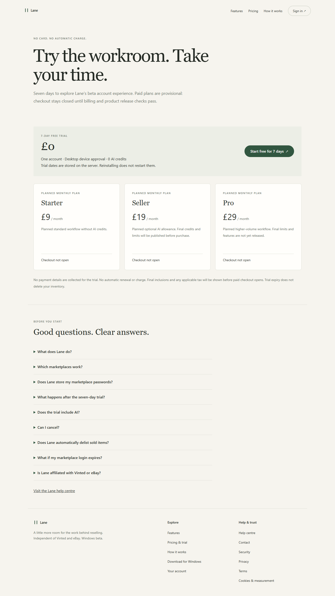

## How it works

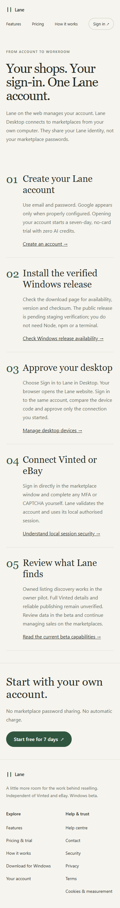

## Signup

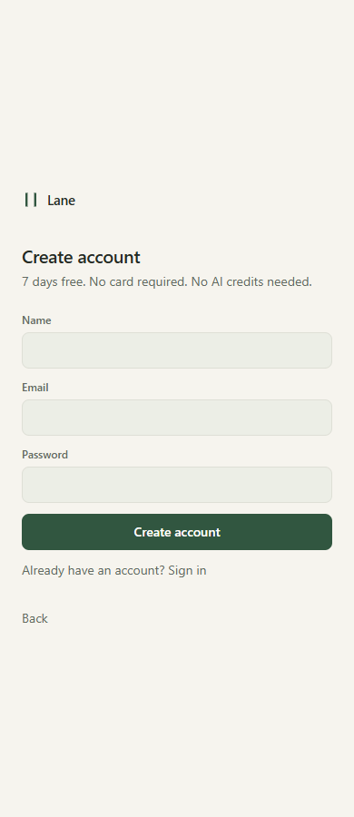

## Login

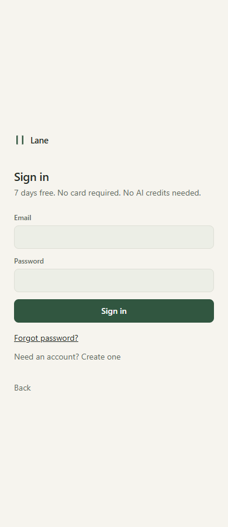

## Account created and trial started

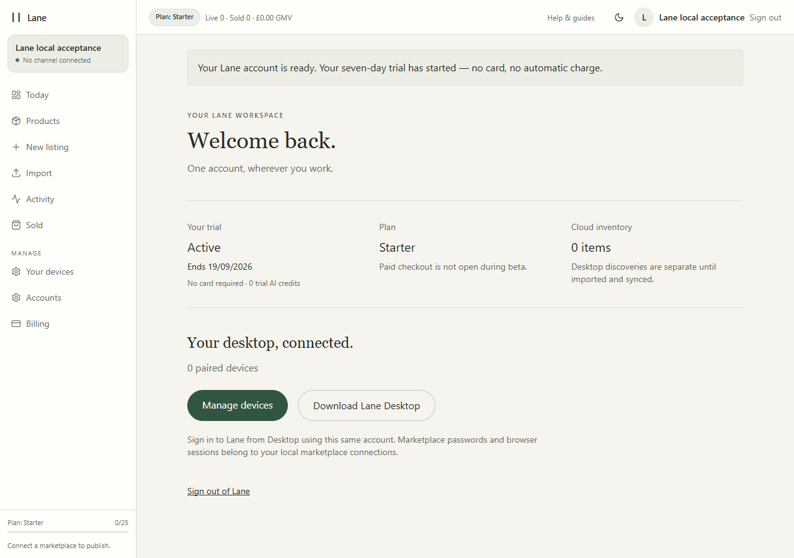

## Account / trial

## Devices — synthetic protocol test

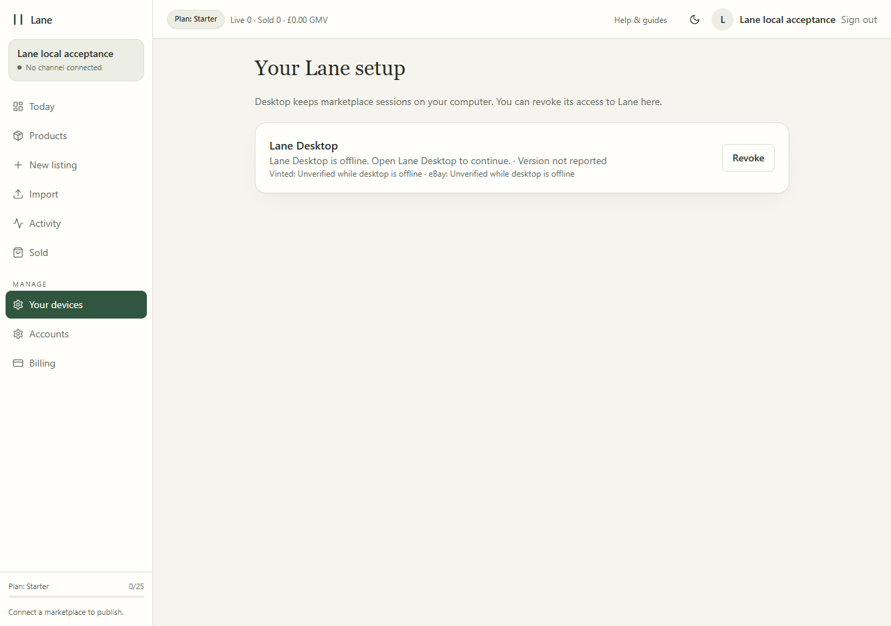

## Trial ended; inventory retained

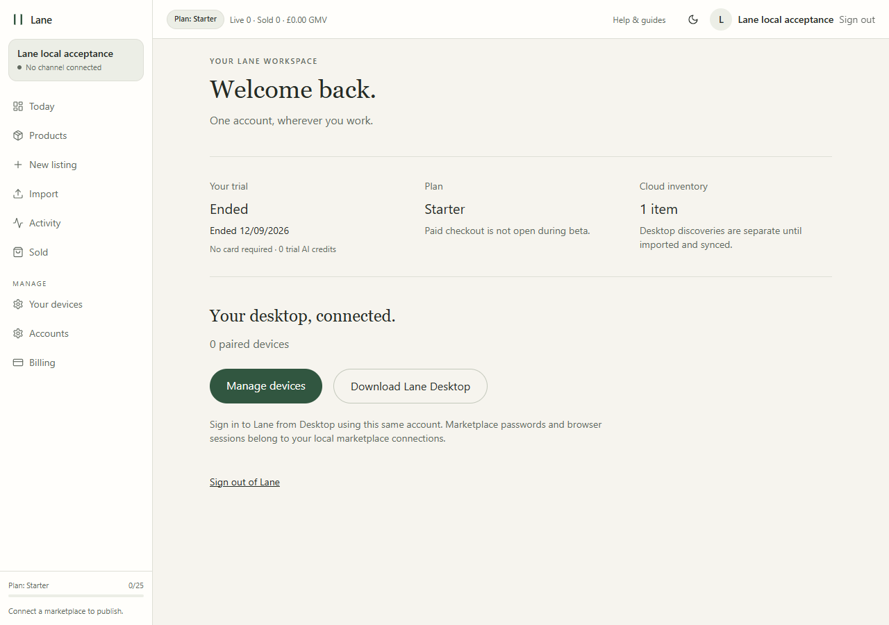

## Download — verified release pending

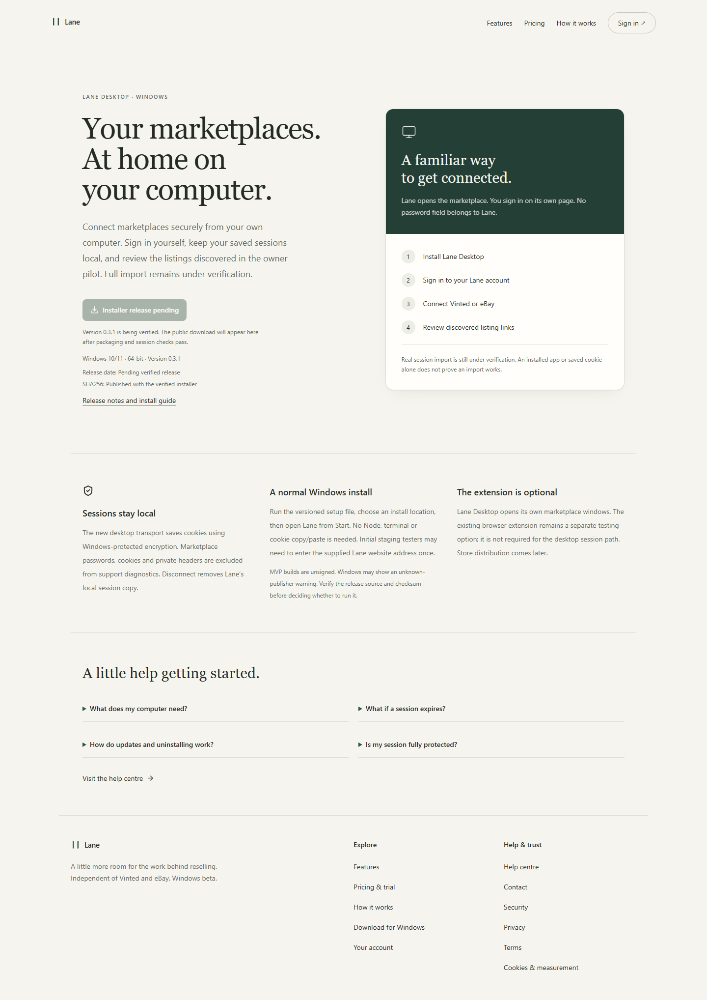

## Help

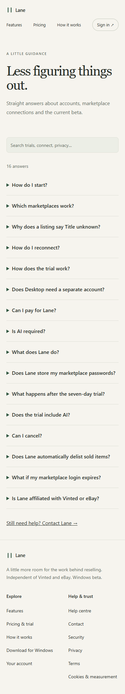

## Saved support request — intake enabled only in fixture

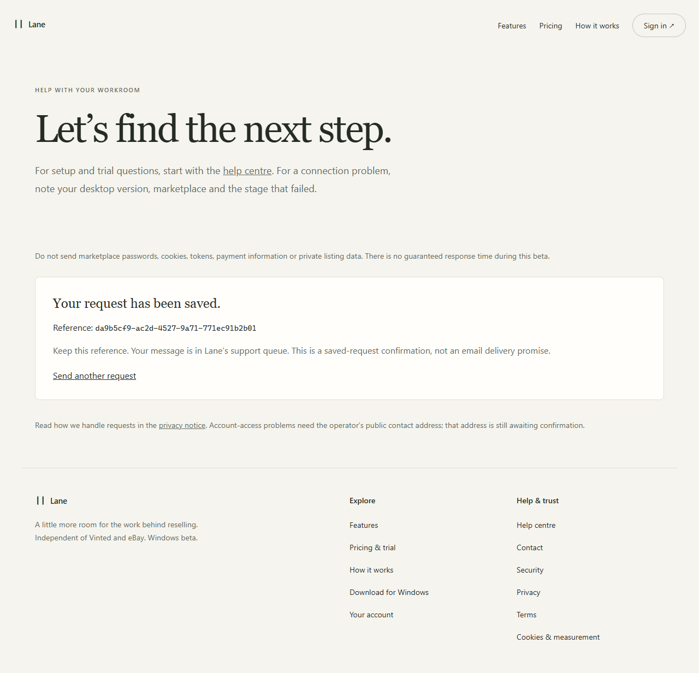

## Custom HTTP 404

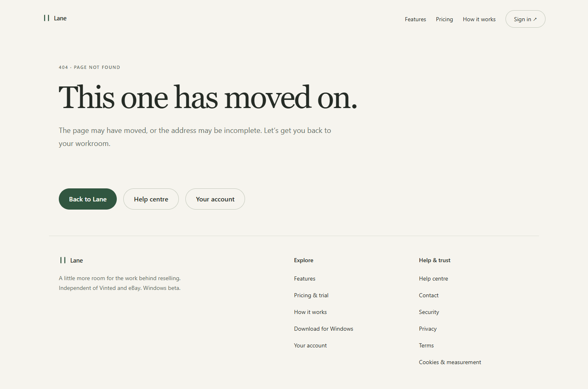

