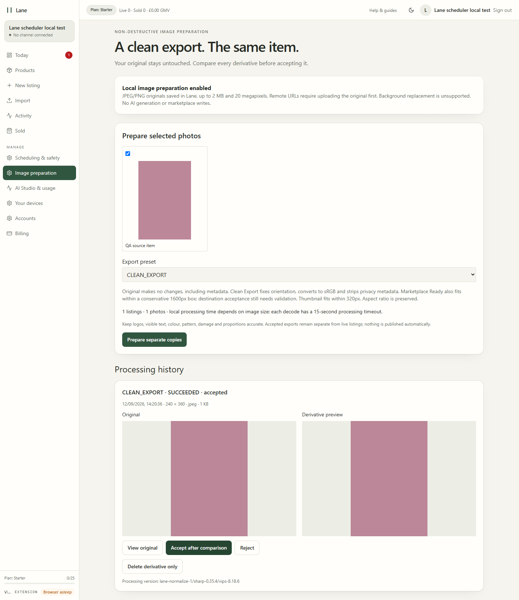
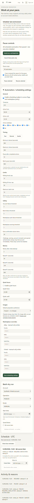

# Scheduler and normalization review — 12 September 2026

**LOCAL PRODUCTION BUILD. Synthetic account, images and listing only.**

The screenshots show an isolated test with scheduler/manual reminders and image preparation
enabled. Bulk automation remained disabled; normal deployment flags remain OFF. There is no
public staging deployment and these screenshots contain no real marketplace session data.

21 PostgreSQL/image tests pass, using all 21 migrations, isolated schema, fake clocks and local
executor stubs. 31 focused legacy-worker/reliable-operation/authentication/desktop regressions
pass. The actual production browser test passes signup, saved settings, dry run, approved manual
reminder, due-user-action state, global pause/resume, image preparation/comparison/review/deletion
and source byte preservation. No external browser requests or marketplace writes occurred.
The final normal-process test verified flags OFF and signed-out private routes redirecting to login
before hydration; authenticated signup/navigation still pass. Typecheck and fresh Node build pass.

Axe reported zero violations on the tested pages at 1440/768/390/320px. No horizontal overflow
was detected at those widths. This is automated coverage plus visual inspection, not a complete
accessibility certification. Scheduler screenshots have a long expanded settings section;
users can collapse it.

See [architecture and release boundaries](../SCHEDULER_ARCHITECTURE.md).
Local raw evidence: `artifacts/scheduler-tests.log`, `scheduler-regressions.log`,
`scheduler-browser.log`, `scheduler-qa/result.json`, build/typecheck logs.

